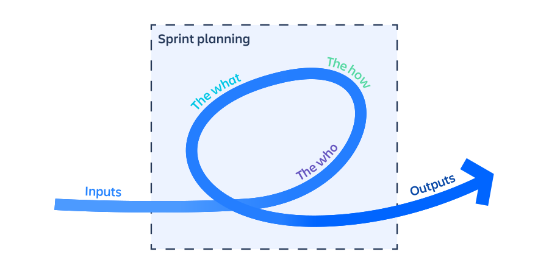

<h2 style="color:red">Glossaire Agile</h2>

### <h3 style="color: white">Daily Meeting:

Une cérémonie quotidienne de 15 minutes qui permet suivre la progression vers l’objectif de sprint de l’équipe.

On retrouve généralement sur ce support, plusieurs colonnes.

<ul>
<li>A faire</li>
<li>En cours</li>
<li>Revue de code</li>
<li>A qualifier PO (premiers tests par le Product Owner) </li>
<li>A qualifier (tests réalisés par la/le QA)</li>
<li>Fini</li>
<li>A corriger (lorsqu’une anomalie est détectée durant le sprint de développement, elle est alors indiquée en “à corriger”, elle reprend ensuite le workflow décrit ci-dessus) </li>
</ul>

### <h3 style="color: white">Planning Poker</h3>

Le planning poker Scrum va réunir l’équipe projet autour du Scrum Master qui va faire en sorte de faciliter les différents échanges qui pourront avoir lieux entre les participants autour des fonctionnalités étudiées.

Tout l’intérêt du planning poker est que chacun sa pierre à l’édifice, en fonction de son expérience, de son expertise et de son ressenti. L’apport d’informations très diverses et leurs prises en compte ne pourront que consolider au final l’estimation qui sera faite, car toute la complexité de la fonctionnalité demandée aura été mise en lumière et portée à la connaissance de tous.

### <h3 style="color: white">Product Backlog</h3>

List à fair dans le bon ordre

### <h3 style="color: white">Product Owner</h3>

est un chef de produit digital en mode agile.  Tourné vers l’opérationnel, il est chargé d’optimiser le produit tout au long de son développement. Il fait le lien entre le client, le scrum master, l’équipe technique et l’équipe marketing. 

### <h3 style="color: white">Release</h3>

 Une release est une nouvelle version du produit, livrée aux utilisateurs. Elle est le fruit de plusieurs Sprints.

### <h3 style="color: white">Scrum Master</h3>

est responsable de la mêlée (Scrum) et veille à ce que le framework Scrum soit respecté. Celui-ci comporte un ensemble clairement défini de rôles et de rituels qui doivent être suivis, et le Scrum Master travaille avec chaque membre de l'équipe Scrum pour les guider et les coacher dans le framework Scrum.

### <h3 style="color: white">Sprint</h3>

Un sprint désigne une brève période limitée dans le temps dont une équipe Scrum a besoin pour effectuer une quantité de travail donnée.

### <h3 style="color: white">Sprint Planning</h3>

La planification du sprint est une cérémonie Scrum qui lance le sprint. Elle a pour objectif de définir ce qui peut être livré dans le sprint et comment y parvenir. La planification du sprint est effectuée en collaboration avec toute l'équipe Scrum.

### <h3 style="color: white">Sprint Review</h3>

Cette réunion a lieu à la fin de chaque sprint, afin de passer en revue le travail accompli durant le sprint écoulé. C’est le moment de présenter les développements logiciels apportés au produit, qui sont testés et fonctionnels.

### <h3 style="color: white">Rétrospective</h3>

est une réunion positionnée à la fin de chaque sprint (sprint = itération) pendant laquelle l'équipe Scrum met à profit son vécu sur le sprint écoulé pour améliorer son organisation afin d'être plus efficace.

Ex: Spead boat,mad glad sad...

### <h3 style="color: white">User Story</h3>

Une user story est une explication non formelle, générale d'une fonctionnalité logicielle écrite du point de vue de l'utilisateur final.

I.N.V.E.S.T.

    I – Indépendante
    N – Négociable
    V – de Valeur
    E – Estimable
    S – Suffisamment petite
    T – Testable

- Indépendante
Chaque « User Stories » doit être indépendante l’une de l’autre. Ceci empêche les chevauchements entre les items; de plus, cela permet à l’équipe de les implémenter dans n’importe quel ordre.

- Négociable
Les détails du travail doivent être négociables, tant parmi les parties prenantes que l’équipe. Les besoins spécifiques et décisions de conception seront étoffés pendant le développement. Beaucoup de praticiens agiles recommandent d’écrire les « User Stories » sur une petite fiche – ceci est intentionnel pour qu’une quantité limitée de détails puisse être prescrite.

-  Valeur
Chaque « User Stories »doit ajouter un valeur métier/business au produit, au client et/ou à l’expérience des utilisateurs.

- Estimable
Une bonne « User Stories » peut être suffisamment bien comprise par l’équipe pour qu’ils puissent l’évaluer – pas précisément – mais qu’à un haut niveau ils en perçoivent la taille. Il est utile de comprendre l’effort relatif en comparaison d’autres « User Stories ».

- Suffisamment petite
Une « User Story » n’est pas assez petite si l’équipe ne peut pas la faire faire dans un seul Sprint. Comme des grandes « User Stories » sont divisées en items plus petits, la clarté sur la taille et la mise en œuvre est plus grande, ce qui améliore la probabilité que l’équipe le réalisera en un Sprint.

- Testable
Chaque « User Story » devrait être testable; ceci est une caractéristique commune de tout besoin bien écrit. Si l’équipe ne peut pas déterminer comment la « User Story » peut être testée, c’est une indication que la fonction désirée ou la valeur business désirée ne sont pas assez claires.

### Formulation de user story

EN TANT QUE.....[PERSONA]

JE VEUX.........[FONCTIONNALITE]

AFIN DE.........[VALEUR PERÇUE]

### <h3 style="color: white">Valeur métier</h3>

La valeur métier est aussi appelée valeur économique. Elle se base sur un rapport coûts et bénéfices. En effet, elle est déterminée par plusieurs caractéristiques : la valeur commerciale (ce produit me fait gagner ou économiser de l’argent), la valeur marché (clients potentiels), valeur sociale (statut social) et la valeur temporelle (gain à long terme). Ces critères définissent ainsi la valeur métier qui sera attribuée à chaque fonctionnalité du produit pour les prioriser.

### <h3 style="color: white">Vélocité</h3>

 La vélocité agile permet de déterminer l’effort qu’est capable de fournir une équipe de développement pour la réalisation des tâches programmées dans un sprint. Elle est exprimée en nombre de points.

